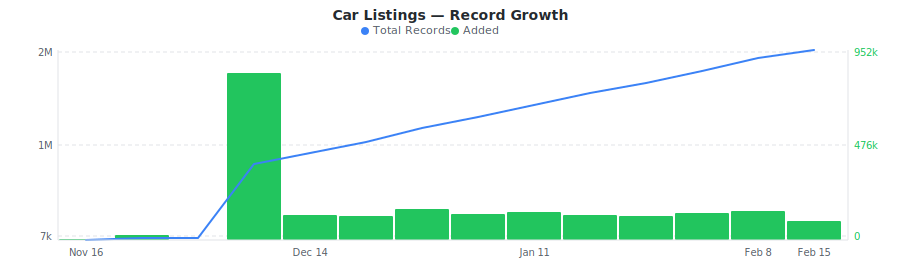

# Carfax Used Car Listings & Dealer Inventory Dataset

&nbsp;&nbsp;[](https://rebrowser.net/products/datasets/carfax)

A sample of Carfax marketplace listings with vehicle specs, mileage, dealer ratings, history verification, reliability badges, and One Price value estimates.


This repository contains a preview sample of the [Carfax dataset](https://rebrowser.net/products/datasets/carfax) published by Rebrowser. If you're doing academic research, you may be eligible for free access to a much larger slice — see [Free Datasets for Research](https://rebrowser.net/free-datasets-for-research).


This dataset contains **1** entity, each in its own folder: Car Listings (`car-listings`). See below for a full field breakdown, sample counts, and data distributions for each.

*Found this useful? ⭐ Star this repo to help us keep publishing fresh data. Found an error? [Let us know](https://rebrowser.net/contact-us).*


---

### Car Listings
A sample of Carfax marketplace listings with year, make, model, mileage, body style, drivetrain, dealer location, ratings, history verification, and reliability data.


> **2,454,318** total records from 2025-11-16 to 2026-02-15, **up to 30,000** rows in this sample (1.2% of full dataset).
> Exported as one file per day, up to 1,000 rows each, last undefined days retained.



| Field | Type | Fill Rate | Description |
| --- | --- | --- | --- |
| `_primaryKey` | `string` | 100% | Unique identifier for this record |
| `_firstSeenAt` | `datetime` | 100% | First time this record was seen |
| `_lastSeenAt` | `datetime` | 100% | Last time this record was updated |
| `listingId` | `string` | 100% | Unique CARFAX listing identifier (VIN + dealer code + date) |
| `vin` 🔒 | `string` | 100% | Vehicle Identification Number (17-character unique code) |
| `stockNumber` | `string` | 98% | Dealer stock number |
| `year` | `float` | 100% | Vehicle model year |
| `make` | `string` | 100% | Vehicle manufacturer (e.g., Nissan, Toyota, Honda) |
| `model` | `string` | 100% | Vehicle model (e.g., Sentra, Camry, Accord) |
| `trim` | `string` | 100% | Vehicle trim level (e.g., SV, EX, Limited) |
| `subTrim` | `string` | 14% | Vehicle sub-trim (often "Unspecified") |
| `bodyStyle` | `string` | 100% | Vehicle body style (e.g., Sedan, SUV, Truck, Coupe) |
| `exteriorColor` | `string` | 100% | Vehicle exterior color (e.g., White, Black, Red) |
| `interiorColor` | `string` | 91% | Vehicle interior color (e.g., Black, Gray, Tan) |
| `engine` | `string` | 100% | Engine type (e.g., "4 Cyl", "6 Cyl", "8 Cyl") |
| `displacement` | `string` | 100% | Engine displacement (e.g., "2.0 L", "3.5 L") |
| `drivetrain` | `string` | 100% | Drivetrain type (e.g., FWD, RWD, AWD, 4WD) |
| `transmission` | `string` | 100% | Transmission type (e.g., Automatic, Manual, CVT) |
| `fuelType` | `string` | 100% | Fuel type (e.g., Gasoline, Diesel, Electric, Hybrid) |
| `mileage` | `float` | 100% | Odometer reading in miles |
| `listPrice` 🔒 | `float` | 100% | Listed price in USD |
| `currentPrice` 🔒 | `float` | 100% | Current asking price in USD |
| `onePrice` | `float` | 88% | CARFAX One Price value estimate in USD |
| `badge` | `string` | 80% | CARFAX value badge (e.g., GOOD, GREAT, FAIR) |
| `vehicleCondition` | `string` | 100% | Vehicle condition (e.g., Used, Certified, New) |
| `cabType` | `string` | 22% | Truck cab type (e.g., Crew Cab, Extended Cab, Regular Cab) |
| `bedLength` | `string` | 16% | Truck bed length (e.g., Short Bed, Long Bed) |
| `mpgCity` | `float` | 88% | City fuel economy in MPG |
| `mpgHighway` | `float` | 88% | Highway fuel economy in MPG |
| `mpgCombined` | `float` | 88% | Combined fuel economy in MPG |
| `noAccidents` | `bool` | 67% | Whether vehicle has no reported accidents |
| `serviceRecords` | `bool` | 98% | Whether vehicle has service history records |
| `personalUse` | `bool` | 71% | Whether vehicle was used for personal use |
| `oneOwner` | `bool` | 50% | Whether vehicle has only one previous owner |
| `ownerHistory` | `array` | 97% | Array of owner history records (JSON strings with ownerNumber, purchaseDate, endOwnershipDate, city, state) |
| `serviceRecordCount` | `float` | 100% | Number of service history records |
| `imageCount` | `float` | 95% | Number of listing photos |
| `followCount` | `float` | 100% | Number of users following this listing |
| `firstSeen` | `string` | 100% | Date listing first appeared (YYYY-MM-DD) |
| `recordType` | `string` | 100% | CARFAX record type (e.g., ENHANCED, BASIC) |
| `sellerType` | `string` | 100% | Seller type (e.g., NEW, USED) |
| `advantage` | `bool` | 99% | Whether seller has CARFAX Advantage badge |
| `sellerName` 🔒 | `string` | 100% | Seller/dealer name |
| `sellerCity` | `string` | 100% | Seller city |
| `sellerState` | `string` | 100% | Seller state code |
| `sellerZip` | `string` | 100% | Seller ZIP code |
| `sellerPhone` 🔒 | `string` | 100% | Seller phone number |
| `sellerRating` | `float` | 94% | Seller average rating (1-5 scale) |
| `sellerReviewCount` | `float` | 94% | Number of seller reviews |
| `sellerId` | `string` | 100% | CARFAX seller/dealer identifier |
| `sellerInventoryUrl` | `string` | 100% | Seller inventory website URL |
| `sellerLatitude` | `float` | 100% | Seller location latitude |
| `sellerLongitude` | `float` | 100% | Seller location longitude |
| `sellerGroupName` | `string` | 75% | Seller group/parent company name |
| `sellerLogoUrl` 🔒 | `string` | 44% | Seller logo image URL |
| `sellerBadgeExperience` | `string` | 100% | Seller badge experience type (e.g., TOPRATED, LIFETIME, ADVANTAGE) |
| `reliabilityBadge` | `string` | 29% | Overall reliability badge (e.g., GOOD, AVERAGE, POOR) |
| `reliabilityCostBadge` | `string` | 29% | Repair cost badge (e.g., AVERAGE, LOW, HIGH) |
| `reliabilityRiskBadge` | `string` | 29% | Repair risk badge (e.g., AVERAGE, LOW, HIGH) |
| `reliabilityAvgCost` | `float` | 29% | Average repair cost in USD |
| `listingUrl` | `string` | 100% | Vehicle listing page URL |
| `images` 🔒 | `array` | 95% | Array of large image URLs |
| `imagesCount` | `float` | 95% | Number of listing images |
| `topOptions` | `array` | 97% | Top vehicle options/features |
| `topOptionsCount` | `float` | 97% | Number of top options/features |
| `otherOptions` | `array` | 99% | Additional vehicle options/features |
| `otherOptionsCount` | `float` | 99% | Number of other options/features |
| `description` | `string` | 92% | Seller description of the vehicle |
| `icrUrl` 🔒 | `string` | 100% | URL to CARFAX vehicle history report |
| `windowSticker` 🔒 | `string` | 53% | URL to vehicle window sticker |
| `sortScore` | `float` | 100% | CARFAX listing sort/ranking score |
| `snapshotDamageSeverity` | `string` | 8% | Damage severity from snapshot (e.g., minor, moderate, severe) |


> 🔒 **Premium fields** are included in the data files but their values are replaced with `[PREMIUM]`. To access real values, [use our website](https://rebrowser.net/products/datasets/carfax).


#### Field Distributions


<details>
<summary><strong>Body Style Distribution</strong> (<code>bodyStyle</code>)</summary>


| Value | Count | Share |
| --- | --- | --- |
| SUV | 1,004,629 | `████████░░░░░░░░░░░░` 40.9% |
| Sedan | 531,078 | `████░░░░░░░░░░░░░░░░` 21.6% |
| Pickup | 525,184 | `████░░░░░░░░░░░░░░░░` 21.4% |
| Coupe | 90,865 | `█░░░░░░░░░░░░░░░░░░░` 3.7% |
| Hatchback | 72,795 | `█░░░░░░░░░░░░░░░░░░░` 3.0% |
| Minivan | 69,223 | `█░░░░░░░░░░░░░░░░░░░` 2.8% |
| Wagon | 60,262 | `░░░░░░░░░░░░░░░░░░░░` 2.5% |
| Convertible | 46,581 | `░░░░░░░░░░░░░░░░░░░░` 1.9% |
| Van | 39,537 | `░░░░░░░░░░░░░░░░░░░░` 1.6% |
| Chassis | 14,162 | `░░░░░░░░░░░░░░░░░░░░` 0.6% |

</details>


<details>
<summary><strong>Top Makes</strong> (<code>make</code>)</summary>


| Value | Count | Share |
| --- | --- | --- |
| Ford | 313,688 | `████░░░░░░░░░░░░░░░░` 19.0% |
| Chevrolet | 279,884 | `███░░░░░░░░░░░░░░░░░` 16.9% |
| Toyota | 247,827 | `███░░░░░░░░░░░░░░░░░` 15.0% |
| Honda | 160,928 | `██░░░░░░░░░░░░░░░░░░` 9.7% |
| Jeep | 119,331 | `█░░░░░░░░░░░░░░░░░░░` 7.2% |
| Nissan | 118,098 | `█░░░░░░░░░░░░░░░░░░░` 7.1% |
| GMC | 115,370 | `█░░░░░░░░░░░░░░░░░░░` 7.0% |
| Ram | 103,699 | `█░░░░░░░░░░░░░░░░░░░` 6.3% |
| BMW | 102,043 | `█░░░░░░░░░░░░░░░░░░░` 6.2% |
| Mercedes-Benz | 94,448 | `█░░░░░░░░░░░░░░░░░░░` 5.7% |

</details>


<details>
<summary><strong>Drivetrain Distribution</strong> (<code>drivetrain</code>)</summary>


| Value | Count | Share |
| --- | --- | --- |
| FWD | 721,400 | `██████░░░░░░░░░░░░░░` 29.4% |
| 4WD | 700,743 | `██████░░░░░░░░░░░░░░` 28.6% |
| AWD | 669,363 | `█████░░░░░░░░░░░░░░░` 27.3% |
| RWD | 361,805 | `███░░░░░░░░░░░░░░░░░` 14.7% |
| Unspecified | 1,006 | `░░░░░░░░░░░░░░░░░░░░` 0.0% |
| 2WD | 1 | `░░░░░░░░░░░░░░░░░░░░` 0.0% |

</details>


<details>
<summary><strong>Listings by State</strong> (<code>sellerState</code>)</summary>


| Value | Count | Share |
| --- | --- | --- |
| TX | 265,149 | `████░░░░░░░░░░░░░░░░` 19.8% |
| CA | 255,008 | `████░░░░░░░░░░░░░░░░` 19.0% |
| FL | 241,649 | `████░░░░░░░░░░░░░░░░` 18.0% |
| NJ | 93,635 | `█░░░░░░░░░░░░░░░░░░░` 7.0% |
| NC | 87,389 | `█░░░░░░░░░░░░░░░░░░░` 6.5% |
| OH | 84,549 | `█░░░░░░░░░░░░░░░░░░░` 6.3% |
| GA | 82,135 | `█░░░░░░░░░░░░░░░░░░░` 6.1% |
| PA | 78,565 | `█░░░░░░░░░░░░░░░░░░░` 5.9% |
| AZ | 77,368 | `█░░░░░░░░░░░░░░░░░░░` 5.8% |
| IL | 75,684 | `█░░░░░░░░░░░░░░░░░░░` 5.6% |

</details>


<details>
<summary><strong>Value Badge Distribution</strong> (<code>badge</code>)</summary>


| Value | Count | Share |
| --- | --- | --- |
| GREAT | 898,359 | `█████████░░░░░░░░░░░` 45.7% |
| GOOD | 630,559 | `██████░░░░░░░░░░░░░░` 32.1% |
| FAIR | 437,329 | `████░░░░░░░░░░░░░░░░` 22.2% |

</details>


<details>
<summary><strong>Vehicle Condition</strong> (<code>vehicleCondition</code>)</summary>


| Value | Count | Share |
| --- | --- | --- |
| Used | 2,453,921 | `████████████████████` 100.0% |
| New | 397 | `░░░░░░░░░░░░░░░░░░░░` 0.0% |

</details>


---

## Pre-built Views on Rebrowser

Rebrowser web viewer lets you filter, sort, and export any slice of this dataset interactively. These pre-built views are ready to open:


### Car Listings


[Listings with History Verification](https://rebrowser.net/products/datasets/carfax/car-listings/views/listings-with-history-verification) — 2,167,238 records

↳ `[{"sort":"currentPrice DESC"}]`

[Clean Title No-Accident Listings](https://rebrowser.net/products/datasets/carfax/car-listings/views/clean-title-no-accidents) — 1,443,041 records

↳ `[{"field":"noAccidents","op":"isTrue"},{"sort":"currentPrice DESC"}]`

[New Vehicle Listings](https://rebrowser.net/products/datasets/carfax/car-listings/views/new-vehicle-listings) — 377 records

↳ `[{"field":"vehicleCondition","op":"is","value":"New"},{"sort":"currentPrice DESC"}]`

[Advantage Dealer Listings](https://rebrowser.net/products/datasets/carfax/car-listings/views/advantage-dealers) — 2,124,677 records

↳ `[{"field":"advantage","op":"isTrue"},{"sort":"sellerRating DESC"}]`

[One-Owner Vehicle Listings](https://rebrowser.net/products/datasets/carfax/car-listings/views/one-owner-vehicles) — 1,081,661 records

↳ `[{"field":"oneOwner","op":"isTrue"},{"sort":"mileage ASC"}]`


*[See all 28 views →](https://rebrowser.net/products/datasets/carfax/car-listings)*


---

## Code Examples

```python
import pandas as pd
from pathlib import Path

# ── Car Listings ───────────────────────────────────────────────────────────
# Load the last 7 days of listings
files = sorted(Path('rebrowser/carfax-dataset/car-listings/data').glob('*.parquet'))[-7:]
listings = pd.concat([pd.read_parquet(f) for f in files])

# Top 10 makes by listing count
print(listings['make'].value_counts().head(10).to_string())

# Average mileage by body style
print(listings.groupby('bodyStyle')['mileage'].mean().sort_values().to_string())

# No-accident listings by state — top 10 states
clean = listings[listings['noAccidents'] == True]
print(clean['sellerState'].value_counts().head(10).to_string())

# Dealer ratings: top-rated sellers with 50+ reviews
top_dealers = listings[listings['sellerReviewCount'] >= 50]
print(top_dealers.groupby('sellerId')['sellerRating']
      .first().sort_values(ascending=False).head(10).to_string())

# Badge distribution (GOOD, GREAT, FAIR) by drivetrain
print(pd.crosstab(listings['drivetrain'], listings['badge']).to_string())

# One-owner SUVs with service records
one_owner_suvs = listings[
    (listings['oneOwner'] == True) &
    (listings['bodyStyle'] == 'SUV') &
    (listings['serviceRecords'] == True)
]
print(f"One-owner SUVs with service records: {len(one_owner_suvs)}")
print(one_owner_suvs[['make', 'model', 'year', 'mileage', 'sellerState']]
      .sort_values('mileage').head(10).to_string(index=False))
```

---

## Use Cases


### Used Car Valuation

Build regression models predicting used car values from mileage, body style, drivetrain, and market location. Validate against One Price estimates and reliability badges.


### Dealer Benchmarking

Rank dealers by rating, review count, and inventory size across states. Identify top-performing dealer groups and study how seller reputation correlates with listing activity.


### Inventory Mix Analysis

Analyze body style, fuel type, and drivetrain distributions across geographic markets. Detect which vehicle segments are over- or under-represented in specific states.


### Vehicle History Signals

Study how no-accident history, one-owner status, and service record counts vary by make, model, and age. Quantify the frequency of clean-history vehicles across market segments.


---

## Full Dataset on Rebrowser


This repo is a 1,000-row preview sample. The full dataset is at [rebrowser.net/products/datasets/carfax](https://rebrowser.net/products/datasets/carfax)

Doing academic research? You may qualify for free access to a larger slice. See [Free Datasets for Research](https://rebrowser.net/free-datasets-for-research).

On Rebrowser you can:
- **Filter before you buy** — use the web UI to apply filters on any field and sort by any column. Preview results before purchasing. You only pay for records that match your criteria.
- **Export in your format** — CSV, JSON, JSONL, or Parquet depending on your plan.
- **Access via API** — integrate dataset queries into your pipelines and workflows.
- **Choose your freshness** — plans range from a 14-day lag to real-time data with no delay.
- **Select only the fields you need** — keep exports lean. Premium fields with richer data are available on higher plans.

[Pricing](https://rebrowser.net/pricing) starts at **$2 per 1,000 rows** with volume discounts.

---

## License & Terms

**Free for research and non-commercial use** with attribution. See [license terms](https://rebrowser.net/free-datasets-for-research#license) and [how to cite](https://rebrowser.net/free-datasets-for-research#citation).

```bibtex
@misc{rebrowser_carfax,
  author       = {Rebrowser},
  title        = {Carfax Used Car Listings & Dealer Inventory Dataset},
  year         = {2026},
  howpublished = {\url{https://rebrowser.net/products/datasets/carfax}},
  note         = {Accessed: YYYY-MM-DD}
}
```

Commercial use requires a paid license — see [pricing](https://rebrowser.net/pricing). Use of this data is governed by the [Rebrowser Terms of Use](https://rebrowser.net/terms-of-use), which may be updated at any time independently of this repository.

---

## Disclaimer

Rebrowser is an independent data provider and is not affiliated with, endorsed by, or sponsored by Carfax. Any trademarks are the property of their respective owners. This dataset is compiled from publicly available information; we do not request or collect Carfax user credentials. By using this dataset, you agree to comply with Carfax's Terms of Service and all applicable laws and regulations. Images, logos, descriptions, and other materials included in this dataset remain the intellectual property of their respective owners and are provided solely for informational purposes. Rebrowser makes no warranties regarding the accuracy, completeness, or legality of the data and assumes no liability for how the data is used. You are solely responsible for ensuring that your use of this dataset does not infringe on the rights of any third party.


You can also find this data on [Kaggle](https://www.kaggle.com/datasets/rebrowser/carfax-dataset), [HuggingFace](https://huggingface.co/datasets/rebrowser/carfax-dataset).


